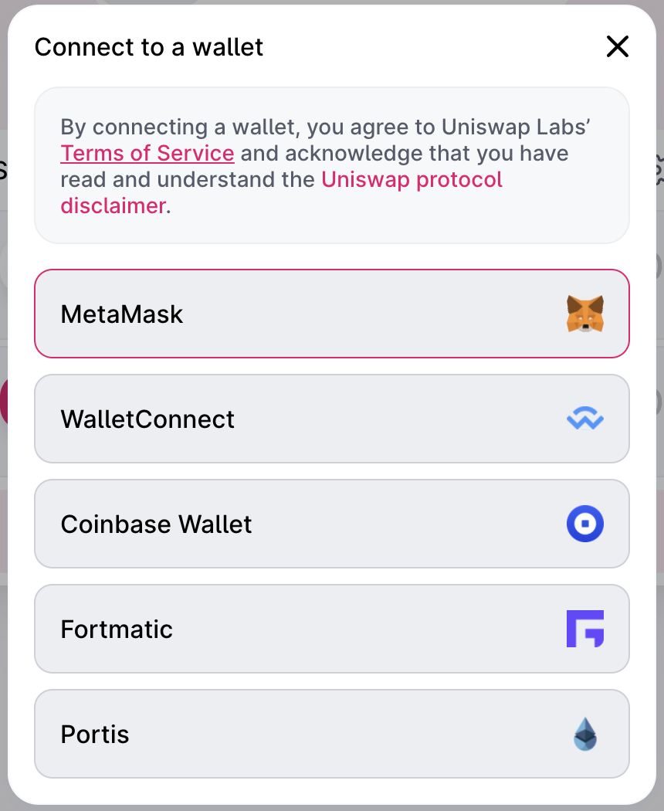
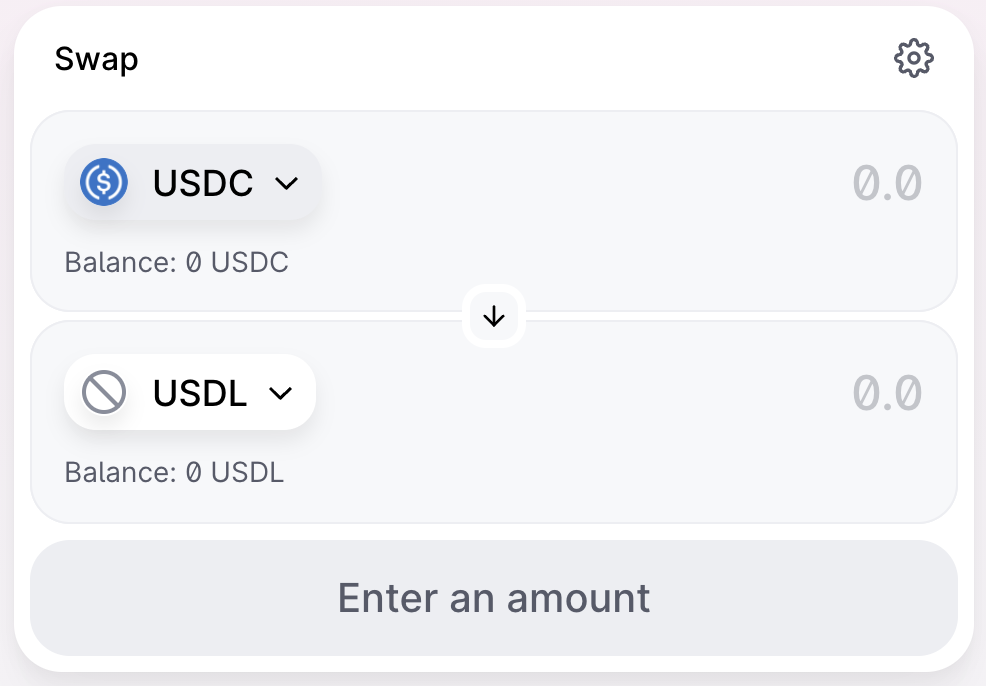

# 🗜️ Swap Mapped Tokens

:::tip

You can connect to MetaMask wallet on [Uniswap](https://app.uniswap.org/#/swap) to exchange USDC to USDM.

:::

After the exchange is completed, you have to cross-chaining Eurus and Ethereum network to make your USDM on Eurus wallet interoperable on Ethereum network ([please see the setup tutorial here](https://www.eurus.network/support/dapp-developer-portal/)), so that you can make transactions through MappedSwap on the Eurus network.

:::tip Example

  

:::

### Learn more 
:::tip Mapped Tokens
[What are Mapped Tokens?](WhatAreTheMappedTokens.md)
:::

