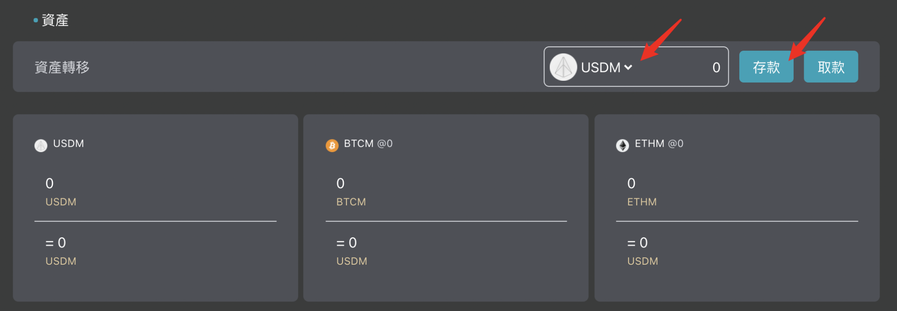

# 🧰 Deposit Mapped Tokens

After completing Eurus network cross-chain settings and receiving USDM, go to  [MappedSwap](https://decatsdevapp.eurus.dev/dashboard), select "USDM" in the asset page, and click "Deposit" to complete the asset transfer.

 

### Learn more 
:::tip Mapped Tokens
[What are Mapped Tokens?](WhatAreTheMappedTokens.md)
:::
